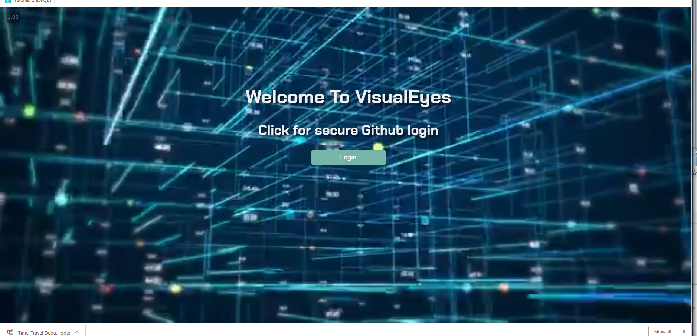
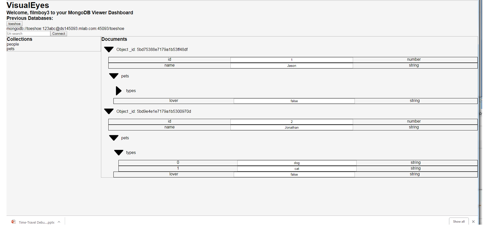

# VisualEyesDB

## VisualEyesDB is a open source web-based GUI for real-time MongoDB updating -- once authenticated (via Github oAuth) simply type in a MongoDB url, and update your NoSQL db instantly, without ever visiting mLab.

With the original creators' blessing, this is an iteration of [VisualEyes](https://github.com/VisualEyez-DB/VisualEyes-DB), version 1.5, expands real-time editing, secure Github oAuth authentication strategy, and handles crucial edge cases, including outside users editing of the databases. Visualize offers clients an easy-to-use UI, full CRUD functionality, and visualization of data, as an alternative to the cumbersome mLab UX. 

# Technologies used:
* React
* Redux
* Github oAuth
* Javascript, ES6, ES7
* NodeJS, ExpressJS
* MongoDB
* EJS
* Webpack 4, Babel 7

# Team:

[Jason Ou @jasonou1994](https://github.com/jasonou1994)

[Jonathan Schwartz @filmboy3](https://github.com/filmboy3)

[Alan Thompson - @PabloSphere](https://github.com/PabloSphere)